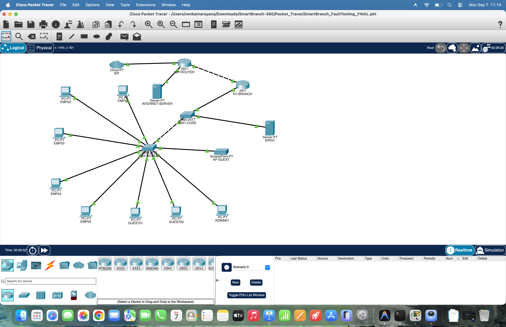
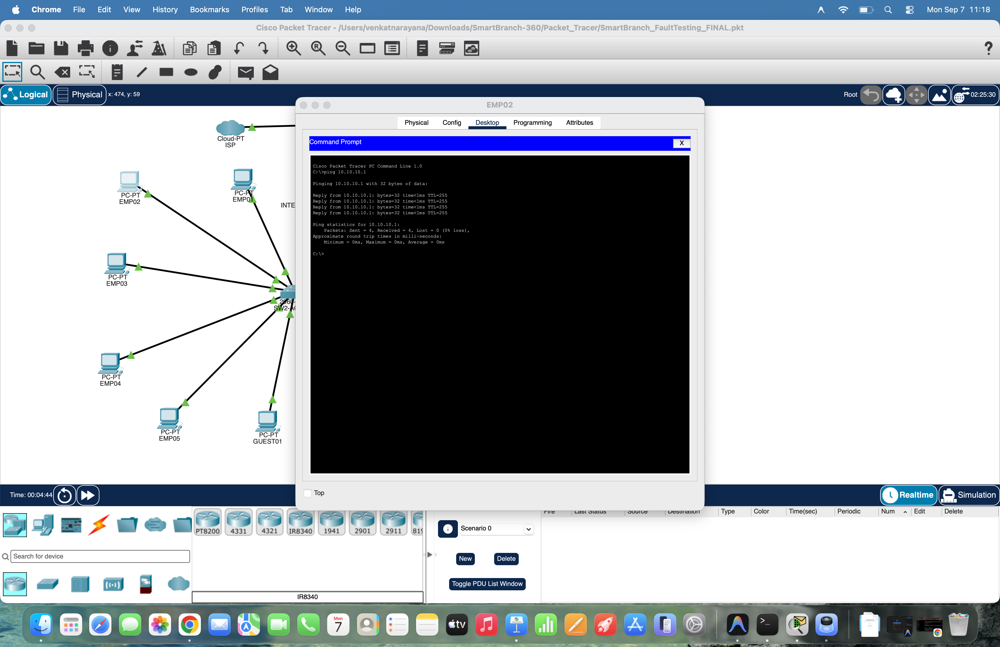

<div align="center">

# SmartBranch 360

### Cisco Packet Tracer Network Configuration, Automated Validation and Fault Detection using Python

**An enterprise branch-network simulation with VLAN segmentation, inter-VLAN routing, DHCP, ACL-based guest isolation and SSH management, verified by a Python checker that reads saved Cisco `show` output and reports PASS / WARN / FAIL.**

<br>

[](#packet-tracer-files-and-instructions)
[](#python-configuration-checker)
[](#requirements-file)
[](#validation-results)
[](#fault-testing)
[](https://github.com/Anilkumar-Guntupalli/SmartBranch-360/commits/main)

<br>

[Overview](#project-overview) · [Getting Started](#getting-started) · [Topology](#network-topology) · [Validation](#validation-results) · [Fault Testing](#fault-testing) · [Documentation](#documentation)

</div>

---

## Table of Contents

1. [Project Overview](#project-overview)
2. [Project Background](#project-background)
3. [Objectives](#objectives)
4. [Key Features](#key-features)
5. [Getting Started](#getting-started)
6. [Network Topology](#network-topology)
7. [Network Architecture](#network-architecture)
8. [VLAN Design and IP Addressing](#vlan-design-and-ip-addressing)
9. [Network Services](#network-services)
10. [Security Design](#security-design)
11. [Connectivity Testing](#connectivity-testing)
12. [Python Configuration Checker](#python-configuration-checker)
13. [Validation Results](#validation-results)
14. [Development and Validation History](#development-and-validation-history)
15. [Fault Testing](#fault-testing)
16. [Screenshots](#screenshots)
17. [Documentation](#documentation)
18. [Project Demonstration Flow](#project-demonstration-flow)
19. [Repository Structure](#repository-structure)
20. [Packet Tracer Files and Instructions](#packet-tracer-files-and-instructions)
21. [Technologies](#technologies)
22. [Skills Demonstrated](#skills-demonstrated)
23. [Limitations and Future Improvements](#limitations-and-future-improvements)
24. [Author](#author)
25. [License](#license)

---

## Project Overview

SmartBranch 360 is an enterprise branch network simulation, configuration validation and fault detection project. It models a new branch office in Cisco Packet Tracer (wired employees, guest Wi-Fi, an internal server, Internet access and secure device management) and then verifies, automatically, that the implemented configuration satisfies a predefined set of network requirements.

The project combines:

1. Cisco Packet Tracer network simulation
2. Enterprise network configuration
3. VLAN segmentation
4. Inter-VLAN routing
5. DHCP
6. DNS requirement validation
7. NAT requirement validation
8. ACL-based traffic control
9. SSH remote management
10. Trunk configuration
11. Network connectivity testing
12. Python-based automated configuration validation
13. YAML-based configuration requirements
14. Cisco `show` command output analysis
15. Network fault testing
16. Five fault cards
17. Documentation and screenshots

The purpose of the project is to build a Smart Branch network and automatically verify whether the implemented configuration satisfies predefined network requirements. The Python checker analyses saved Cisco `show` command outputs and produces `PASS`, `WARN` and `FAIL` results. The final validated configuration produced:

```text
PASS : 47
WARN : 0
FAIL : 0

Overall result: PASS
No required configuration checks failed.
```

### At a Glance

| | |
|---|---|
| **Network** | Four VLANs (10 EMPLOYEE, 20 GUEST, 30 SERVER, 99 MANAGEMENT) routed by the branch router `R1-BRANCH` |
| **Topology** | 16 Packet Tracer devices: 1 cloud, 2 routers, 2 switches, 1 access point, 2 servers and 8 PCs |
| **Security** | Guest → Server, Management and Employee denied; SSH version 2 with local authentication on the VTY lines |
| **Automation** | `SmartBranch_Python_Checker.py` validating `SmartBranch_Requirements.yaml` and saved Cisco `show` outputs |
| **Final validation** | PASS 47 · WARN 0 · FAIL 0, overall **PASS** |
| **Fault testing** | Five fault cards (FC-01 to FC-05), each documented with a PASS result |
| **Final Packet Tracer file** | `SmartBranch_FaultTesting_FINAL.pkt` |

---

## Project Background

SmartBranch 360 follows the *SmartBranch 360* problem statement from the Cisco Virtual Internship 2026 (Project 1: Networking, Packet Tracer and Python). The main course listed in the Project Report is *Networking Essentials*.

**Scenario.** A company is opening a new branch office that needs wired employee access, guest Wi-Fi, an internal server, Internet connectivity and secure management of its network devices. The task is to design and build that network in Cisco Packet Tracer, test that traffic flows correctly, break the network deliberately at least five times to practise troubleshooting, and write a Python tool that validates the design.

The required deliverables map to this repository as follows:

| Problem-statement deliverable | Where it is in this repository |
|---|---|
| Packet Tracer file | [`SmartBranch_FaultTesting_FINAL.pkt`](SmartBranch-360/Packet_Tracer/SmartBranch_FaultTesting_FINAL.pkt) |
| Design document: topology, VLAN/IP table, security rules, troubleshooting notes | [`SmartBranch360_Project_Report.pdf`](SmartBranch-360/Documentation/SmartBranch360_Project_Report.pdf) |
| Requirement file: site name, VLANs and subnets | [`SmartBranch_Requirements.yaml`](SmartBranch-360/Python_Checker/SmartBranch_Requirements.yaml) |
| Python tool with sample validation output | [`SmartBranch_Python_Checker.py`](SmartBranch-360/Python_Checker/SmartBranch_Python_Checker.py), [`Real_Show_Outputs/`](SmartBranch-360/Python_Checker/Real_Show_Outputs), [`Sample_Show_Outputs/`](SmartBranch-360/Python_Checker/Sample_Show_Outputs) and the console output under [Validation Results](#validation-results) |
| At least five fault scenarios with symptom, root cause and fix | [`SmartBranch_360_Five_Fault_Cards.pdf`](SmartBranch-360/Documentation/SmartBranch_360_Five_Fault_Cards.pdf) |

---

## Objectives

- Design a realistic enterprise branch network.
- Implement VLAN-based network segmentation.
- Provide separate Employee, Guest, Server and Management networks.
- Configure appropriate gateway addresses.
- Enable inter-VLAN routing.
- Configure DHCP services.
- Include DNS and NAT requirements.
- Configure trunk connectivity.
- Implement ACL security policies.
- Configure SSH for secure management access.
- Test network connectivity using Ping.
- Collect Cisco `show` command outputs.
- Store configuration outputs as text files.
- Create a Python automation system to validate network configurations.
- Use YAML to define network requirements.
- Detect missing or incorrect configurations.
- Demonstrate fault testing.
- Document five network fault scenarios.
- Produce a final validation report.

---

## Key Features

**Network design and configuration**

- Four VLANs (Employee, Guest, Server, Management), each with its own `/24` subnet and gateway.
- Inter-VLAN routing on the branch router through per-VLAN subinterfaces on `GigabitEthernet0/1`.
- An 802.1Q trunk carrying VLANs 10, 20, 30 and 99.
- One DHCP pool per VLAN: `EMPLOYEE`, `GUEST`, `SERVER` and `MANAGEMENT`.
- An extended ACL, `GUEST_RESTRICT`, that keeps the Guest network away from the Server, Management and Employee networks.
- SSH version 2 with local VTY authentication and SSH-only VTY transport.
- DHCP, DNS, NAT and inter-VLAN routing defined as required services.

**Automation**

- A Python checker that validates a YAML requirements plan and saved Cisco `show` output.
- `PASS` / `WARN` / `FAIL` findings and a consolidated validation summary.
- Recognition of both configuration-style and `show ip dhcp pool`-style DHCP output.
- A process exit status (`0`, `1` or `2`) that scripts can act on.
- Real captured outputs and compact sample outputs for testing the checker.

**Testing and documentation**

- Ping-based connectivity verification in Packet Tracer.
- Five fault cards covering fault injection, diagnosis, correction and verification.
- A 23-page project report and a 13-page fault-testing report.

---

## Getting Started

### Requirements

| Requirement | Purpose |
|---|---|
| **Cisco Packet Tracer** | Open and explore the `.pkt` project files |
| **Python 3** | Run the configuration checker |
| **PyYAML** | The only external Python package the checker needs |

### Run the checker

```bash
# 1. Clone the repository
git clone https://github.com/Anilkumar-Guntupalli/SmartBranch-360.git

# 2. Open the checker folder
#    (the repository contains an inner SmartBranch-360 project folder)
cd SmartBranch-360/SmartBranch-360/Python_Checker

# 3. Install the only external dependency
python3 -m pip install pyyaml

# 4. Validate the requirements plan against the real Cisco show outputs
python3 SmartBranch_Python_Checker.py --plan SmartBranch_Requirements.yaml --show-dir Real_Show_Outputs
```

Expected ending of the output:

```text
============================================================
SMARTBRANCH 360 VALIDATION SUMMARY
============================================================
PASS : 47
WARN : 0
FAIL : 0

Overall result: PASS
No required configuration checks failed.
```

### Other ways to run the checker

Run all commands from the `Python_Checker` folder.

| Goal | Command | Summary produced |
|---|---|---|
| Validate the requirements plan only | `python3 SmartBranch_Python_Checker.py` | PASS 24 · WARN 0 · FAIL 0 |
| Plan and real show outputs (final configuration) | `python3 SmartBranch_Python_Checker.py --plan SmartBranch_Requirements.yaml --show-dir Real_Show_Outputs` | PASS 47 · WARN 0 · FAIL 0 |
| Plan and sample show outputs | `python3 SmartBranch_Python_Checker.py --plan SmartBranch_Requirements.yaml --show-dir Sample_Show_Outputs` | PASS 47 · WARN 0 · FAIL 0 |
| Plan and your own captured output | `python3 SmartBranch_Python_Checker.py --plan SmartBranch_Requirements.yaml --show-dir my_show_outputs` | Depends on your output |

See [Python Configuration Checker](#python-configuration-checker) for how to capture your own output, and [Packet Tracer Files and Instructions](#packet-tracer-files-and-instructions) for opening the simulation.

---

## Network Topology

The Cisco Packet Tracer topology contains a cloud / ISP, an ISP router, the branch router, a core switch, an access switch, employee PCs, guest PCs, an administrative PC, an internal server, an Internet server and a guest wireless access point.



*Figure 1. SmartBranch 360 topology in Cisco Packet Tracer, captured from `SmartBranch_FaultTesting_FINAL.pkt`.*

### Devices and roles

| Device | Packet Tracer type | Role |
|---|---|---|
| `ISP` | Cloud-PT | Represents the Internet / ISP cloud |
| `ISP-ROUTER` | 2911 router | ISP-side router; connects the cloud, `INTERNET-SERVER` and the branch router |
| `R1-BRANCH` | 2911 router | Branch router: Layer-3 gateway for all four VLANs, inter-VLAN routing, DHCP pools, the Guest ACL and the connection toward the ISP side |
| `SW1-CORE` | 2960-24TT switch | Core switch linking `R1-BRANCH`, `SW2-ACCESS` and `SRV01` |
| `SW2-ACCESS` | 2960-24TT switch | Access switch for the employee, guest and administrative endpoints and the guest access point; carries the VLAN trunk; SSH management enabled |
| `INTERNET-SERVER` | Server-PT | Server on the Internet side, attached to `ISP-ROUTER` |
| `SRV01` | Server-PT | Internal server in the Server network (VLAN 30) |
| `EMP01` to `EMP05` | PC-PT | Employee PCs (VLAN 10, addressed by DHCP) |
| `GUEST01`, `GUEST02` | PC-PT | Guest PCs (VLAN 20, addressed by DHCP) |
| `ADMIN01` | PC-PT | Administrative (management) PC |
| `AP-GUEST` | AccessPoint-PT | Guest wireless access point |

### Connections

- `ISP` cloud ↔ `ISP-ROUTER`
- `ISP-ROUTER` ↔ `INTERNET-SERVER`
- `ISP-ROUTER` ↔ `R1-BRANCH`
- `R1-BRANCH` ↔ `SW1-CORE`
- `SW1-CORE` ↔ `SRV01`
- `SW1-CORE` ↔ `SW2-ACCESS`
- `SW2-ACCESS` ↔ `EMP01`–`EMP05`, `GUEST01`, `GUEST02`, `ADMIN01` and `AP-GUEST`

The topology meets the component counts of the problem statement: a branch router, two switches, one wireless access point, an internal server, an Internet / cloud side and eight endpoints (five employee PCs, two guest PCs and one administrative PC). `ISP-ROUTER` and `INTERNET-SERVER` model the Internet side of the network.

---

## Network Architecture

The branch router provides routing between the VLAN networks and connectivity toward the external / ISP side. The core and access switches provide the Layer-2 infrastructure: VLAN membership for the endpoints and a trunk that carries all four VLANs.

```text
                            Internet
                               │
                         ┌─────┴─────┐
                         │ Cloud-PT  │  "ISP"
                         └─────┬─────┘
                               │
     INTERNET-SERVER ───── ISP-ROUTER (2911)
                               │
                               │   R1-BRANCH Gi0/0 = 203.0.113.2
                               │
                         R1-BRANCH (2911)                 branch router
                               │
                               │   Gi0/1, 802.1Q subinterfaces
                               │     .10   10.10.10.1   VLAN 10   EMPLOYEE
                               │     .20   10.10.20.1   VLAN 20   GUEST
                               │     .30   10.10.30.1   VLAN 30   SERVER
                               │     .99   10.10.99.1   VLAN 99   MANAGEMENT
                               │
                         SW1-CORE (2960-24TT) ─────────── SRV01 (internal server, VLAN 30)
                               │
                               │   trunk carrying VLANs 10, 20, 30, 99 (SW2-ACCESS Fa0/1)
                               │
                         SW2-ACCESS (2960-24TT)
                               │
         ┌───────────────┬─────┴──────────┬────────────────┐
         │               │                │                │
    EMP01 – EMP05    GUEST01 – 02       ADMIN01         AP-GUEST
      (VLAN 10)        (VLAN 20)     (management PC)   (guest Wi-Fi)
```

| Layer | Devices | Responsibility |
|---|---|---|
| **Internet / ISP side** | `ISP`, `ISP-ROUTER`, `INTERNET-SERVER` | Represents the external network the branch connects to |
| **Branch routing** | `R1-BRANCH` | Gateways for VLANs 10, 20, 30 and 99; routing between the VLANs; DHCP pools; `GUEST_RESTRICT` ACL; external interface toward the ISP side |
| **Core switching** | `SW1-CORE` | Aggregates the branch router, the access switch and the internal server |
| **Access switching** | `SW2-ACCESS` | VLAN access ports for endpoints; 802.1Q trunk (`Fa0/1`) carrying VLANs 10, 20, 30 and 99; SSH management |

### R1-BRANCH interface summary

From [`show_interfaces.txt`](SmartBranch-360/Python_Checker/Real_Show_Outputs/show_interfaces.txt) (`show ip interface brief` on `R1-BRANCH`):

| Interface | IP address | Status / Protocol | Purpose |
|---|---|---|---|
| `GigabitEthernet0/0` | 203.0.113.2 | up / up | Link toward the ISP router (the branch router's only other connection in the topology) |
| `GigabitEthernet0/1` | unassigned | up / up | Physical LAN-side interface carrying the subinterfaces |
| `GigabitEthernet0/1.10` | 10.10.10.1 | up / up | Employee gateway (VLAN 10) |
| `GigabitEthernet0/1.20` | 10.10.20.1 | up / up | Guest gateway (VLAN 20) |
| `GigabitEthernet0/1.30` | 10.10.30.1 | up / up | Server gateway (VLAN 30) |
| `GigabitEthernet0/1.99` | 10.10.99.1 | up / up | Management gateway (VLAN 99) |
| `GigabitEthernet0/2` | unassigned | administratively down / down | Shut down |
| `Vlan1` | unassigned | administratively down / down | Shut down |

---

## VLAN Design and IP Addressing

The project requirements define four VLANs:

| VLAN ID | VLAN Name | Subnet | Gateway | Purpose |
|---------|-----------|--------|---------|---------|
| 10 | EMPLOYEE | 10.10.10.0/24 | 10.10.10.1 | Employee network |
| 20 | GUEST | 10.10.20.0/24 | 10.10.20.1 | Guest network |
| 30 | SERVER | 10.10.30.0/24 | 10.10.30.1 | Server network |
| 99 | MANAGEMENT | 10.10.99.0/24 | 10.10.99.1 | Management network |

- **VLAN 10, EMPLOYEE:** network 10.10.10.0/24, gateway 10.10.10.1. Employee computers; normal business network access.
- **VLAN 20, GUEST:** network 10.10.20.0/24, gateway 10.10.20.1. Guest wireless and client devices; Internet access with internal networks restricted.
- **VLAN 30, SERVER:** network 10.10.30.0/24, gateway 10.10.30.1. The internal server network; internal services.
- **VLAN 99, MANAGEMENT:** network 10.10.99.0/24, gateway 10.10.99.1. Network administration and SSH.

### What the checker validates for each VLAN

The Python checker validates:

- the VLAN name
- the VLAN subnet
- the VLAN gateway
- whether the gateway belongs to the expected subnet

All of these final checks passed.

| VLAN | Gateway | Subnet | Gateway inside subnet |
|---|---|---|---|
| 10 | 10.10.10.1 | 10.10.10.0/24 | PASS |
| 20 | 10.10.20.1 | 10.10.20.0/24 | PASS |
| 30 | 10.10.30.1 | 10.10.30.0/24 | PASS |
| 99 | 10.10.99.1 | 10.10.99.0/24 | PASS |

### VLAN membership on SW2-ACCESS

From [`show_vlan_brief.txt`](SmartBranch-360/Python_Checker/Real_Show_Outputs/show_vlan_brief.txt) (`show vlan brief` on `SW2-ACCESS`):

| VLAN | Name | Status | Access ports on SW2-ACCESS |
|---|---|---|---|
| 10 | EMPLOYEE | active | `Fa0/2` – `Fa0/6` |
| 20 | GUEST | active | `Fa0/7`, `Fa0/8` |
| 30 | SERVER | active | none on this switch |
| 99 | MANAGEMENT | active | `Fa0/9`, `Fa0/10` |
| 1 | default | active | `Fa0/11` – `Fa0/24`, `Gig0/1`, `Gig0/2` |

`Fa0/1` is the trunk port and therefore does not appear in the VLAN membership list.

---

## Network Services

### Service requirements

The YAML requirements file declares the following required services. They are project requirements that the checker validates.

| Requirement | YAML key | Value |
|---|---|---|
| DHCP | `services.dhcp` | ENABLED (`true`) |
| DNS | `services.dns` | ENABLED (`true`) |
| NAT | `services.nat` | ENABLED (`true`) |
| Inter-VLAN routing | `services.inter_vlan_routing` | ENABLED (`true`) |

### DHCP

The project contains one DHCP pool for each VLAN network: `EMPLOYEE`, `GUEST`, `SERVER` and `MANAGEMENT`. The final DHCP `show` output contains `Pool EMPLOYEE`, `Pool GUEST`, `Pool SERVER` and `Pool MANAGEMENT`, and is stored in [`Python_Checker/Real_Show_Outputs/show_dhcp.txt`](SmartBranch-360/Python_Checker/Real_Show_Outputs/show_dhcp.txt).

| Pool | VLAN | Network | Gateway | Total addresses | Excluded | Leased |
|---|---|---|---|---|---|---|
| EMPLOYEE | 10 | 10.10.10.0/24 | 10.10.10.1 | 254 | 4 | 5 |
| GUEST | 20 | 10.10.20.0/24 | 10.10.20.1 | 254 | 4 | 2 |
| SERVER | 30 | 10.10.30.0/24 | 10.10.30.1 | 254 | 4 | 0 |
| MANAGEMENT | 99 | 10.10.99.0/24 | 10.10.99.1 | 254 | 4 | 0 |

The address counts are taken from the captured `show ip dhcp pool` output; the lease counts (5 and 2) are consistent with the five employee PCs and two guest PCs in the topology. The checker recognises both the configuration-style form (`ip dhcp pool EMPLOYEE`) and the `show ip dhcp pool` form (`Pool EMPLOYEE :`); see [Development and Validation History](#development-and-validation-history).

### Trunk configuration

Trunk configuration carries the VLAN traffic between the switching and routing infrastructure. The Python checker validates that VLANs **10, 20, 30 and 99** are allowed on the trunk, and produces a PASS result for each VLAN found in the trunk's allowed list. The captured trunk output is stored in [`Python_Checker/Real_Show_Outputs/show_trunk.txt`](SmartBranch-360/Python_Checker/Real_Show_Outputs/show_trunk.txt):

| Port | Mode | Encapsulation | Status | Native VLAN | VLANs allowed on trunk |
|---|---|---|---|---|---|
| `Fa0/1` (`SW2-ACCESS`) | on | 802.1q | trunking | 1 | 10, 20, 30, 99 |

The same four VLANs also appear under "allowed and active in management domain" and "in spanning tree forwarding state and not pruned".

### Inter-VLAN routing

Because the four VLANs use separate IP networks, traffic between them must be routed. The branch router `R1-BRANCH` provides the Layer-3 gateways through subinterfaces on `GigabitEthernet0/1`:

| VLAN | Gateway (router subinterface) |
|---|---|
| 10 | 10.10.10.1 (`GigabitEthernet0/1.10`) |
| 20 | 10.10.20.1 (`GigabitEthernet0/1.20`) |
| 30 | 10.10.30.1 (`GigabitEthernet0/1.30`) |
| 99 | 10.10.99.1 (`GigabitEthernet0/1.99`) |

The requirements plan declares inter-VLAN routing as enabled, the checker verifies that each gateway belongs to its corresponding subnet, and the checker confirms that all four gateway addresses appear in the router's interface output.

### DNS and NAT

DNS and NAT are defined as project requirements in `SmartBranch_Requirements.yaml` (`dns: true`, `nat: true`) and are validated by the checker as declared requirements. The Project Report describes their role in the design:

- **DNS.** A required service that lets clients resolve names instead of remembering IP addresses. The report's required test is *DNS resolution → SUCCESS* from an appropriate client.
- **NAT.** Translates traffic from the internal networks (10.10.10.0/24, 10.10.20.0/24, 10.10.30.0/24 and 10.10.99.0/24) toward the Internet connection.

The checker does not parse DNS or NAT device configuration; see [Limitations and Future Improvements](#limitations-and-future-improvements).

---

## Security Design

### Security requirements

The project contains the following ACL / security requirements. The Python checker validates the required ACL rules.

| Source | Destination | Required result | Defined in |
|---|---|---|---|
| Guest (VLAN 20) | Server (VLAN 30) | **DENY** | `security.guest_to_server` |
| Guest (VLAN 20) | Management (VLAN 99) | **DENY** | `security.guest_to_management` |
| Guest (VLAN 20) | Employee (VLAN 10) | **DENY** | `security.guest_to_employee` |
| Management host | SSH to network devices | **ALLOW** | `security.management_ssh` |
| Guest (VLAN 20) | Internet | ALLOW | Project Report |

The Guest network (10.10.20.0/24) is restricted from accessing the Server (10.10.30.0/24), Management (10.10.99.0/24) and Employee (10.10.10.0/24) networks.

### ACL evidence

The captured `show access-lists` output on `R1-BRANCH` ([`show_acl.txt`](SmartBranch-360/Python_Checker/Real_Show_Outputs/show_acl.txt)) contains the extended ACL `GUEST_RESTRICT`:

```text
Extended IP access list GUEST_RESTRICT
    10 permit udp any eq bootpc any eq bootps (4 match(es))
    20 deny ip 10.10.20.0 0.0.0.255 10.10.30.0 0.0.0.255
    30 deny ip 10.10.20.0 0.0.0.255 10.10.99.0 0.0.0.255
    40 deny ip 10.10.20.0 0.0.0.255 10.10.10.0 0.0.0.255
    50 permit ip 10.10.20.0 0.0.0.255 any
```

*(Excerpt; blank lines removed.)*

| Entry | Meaning |
|---|---|
| 10 | Permits DHCP client-to-server traffic (`bootpc` → `bootps`); not evaluated by the checker |
| 20 | Guest → Server: **deny** |
| 30 | Guest → Management: **deny** |
| 40 | Guest → Employee: **deny** |
| 50 | Guest → any other destination: **permit** |

The checker validates entries 20 to 50: the three `deny` rules and the closing `permit`. The captured output also lists two standard ACLs (`1` and `10`); the checker does not evaluate them.

### SSH configuration

SSH is used for secure remote management of the network devices, and the Management host is required to have SSH access. The Python checker checks for:

- **SSH version 2.** Recognised through output such as `SSH Enabled - version 2.0`, or `ip ssh version 2`.
- **VTY local authentication** (`login local`).
- **SSH-only VTY transport** (`transport input ssh`), where implemented.

The captured output ([`show_ssh.txt`](SmartBranch-360/Python_Checker/Real_Show_Outputs/show_ssh.txt), taken on `SW2-ACCESS`) contains:

```text
SW2-ACCESS#show ip ssh
SSH Enabled - version 2.0
Authentication timeout: 120 secs; Authentication retries: 3

SW2-ACCESS#show running-config | section line vty
line vty 0 4
 login local
 transport input ssh
line vty 5 15
 login local
 transport input ssh

SW2-ACCESS#show running-config | include ip ssh
ip ssh version 2
```

*(Excerpt; blank lines removed and the local-user line omitted.)*

---

## Connectivity Testing

The project uses Ping to verify network connectivity and demonstrate reachability between the relevant devices and networks.

### Recorded evidence

The Ping screenshot in this repository ([`02_ping_success.png`](SmartBranch-360/Screenshots/02_ping_success.png)) shows `EMP02` pinging the Employee VLAN gateway, `10.10.10.1`, with zero packet loss:

```text
C:\>ping 10.10.10.1

Pinging 10.10.10.1 with 32 bytes of data:

Reply from 10.10.10.1: bytes=32 time<1ms TTL=255
Reply from 10.10.10.1: bytes=32 time<1ms TTL=255
Reply from 10.10.10.1: bytes=32 time<1ms TTL=255
Reply from 10.10.10.1: bytes=32 time<1ms TTL=255

Ping statistics for 10.10.10.1:
    Packets: Sent = 4, Received = 4, Lost = 0 (0% loss),
Approximate round trip times in milli-seconds:
    Minimum = 0ms, Maximum = 0ms, Average = 0ms
```

### Test plan and expected results

The Project Report defines four test groups. The table lists the expected outcome of each test.

| Test group | Test | Expected |
|---|---|---|
| 1. VLAN / DHCP | Employee PC DHCP | PASS |
| | Guest PC DHCP | PASS |
| | Server VLAN addressing | PASS |
| | Management addressing | PASS |
| 2. Employee connectivity | Employee → Gateway | PASS |
| | Employee → Server | PASS |
| | Employee → Internet | PASS |
| 3. Guest isolation | Guest → Gateway | PASS |
| | Guest → Internet | PASS |
| | Guest → Server | BLOCK |
| | Guest → Management | BLOCK |
| | Guest → Employee | BLOCK |
| 4. Secure management | Management PC → Router SSH | PASS |
| | Management PC → Switch SSH | PASS |
| | Guest → Device SSH | BLOCK |
| | Employee → Device SSH | BLOCK |

---

## Python Configuration Checker

The Python component is [`SmartBranch_Python_Checker.py`](SmartBranch-360/Python_Checker/SmartBranch_Python_Checker.py). It automatically validates network configuration outputs, so that every configuration does not have to be inspected by hand. The checker uses:

- Python 3
- regular expressions and text parsing
- a YAML requirements file
- Cisco `show` command output files
- `PASS` / `WARN` / `FAIL` findings

### Workflow

```text
Cisco Packet Tracer / Cisco configuration
          ↓
Cisco show commands
          ↓
Saved text outputs
          ↓
Python checker
          ↓
YAML requirements
          ↓
Automated validation
          ↓
PASS / WARN / FAIL
          ↓
Final validation summary
```

### Requirements file

[`SmartBranch_Requirements.yaml`](SmartBranch-360/Python_Checker/SmartBranch_Requirements.yaml) defines the expected network configuration requirements:

```yaml
site: SmartBranch 360

vlans:
  - id: 10
    name: EMPLOYEE
    subnet: 10.10.10.0/24
    gateway: 10.10.10.1

  - id: 20
    name: GUEST
    subnet: 10.10.20.0/24
    gateway: 10.10.20.1

  - id: 30
    name: SERVER
    subnet: 10.10.30.0/24
    gateway: 10.10.30.1

  - id: 99
    name: MANAGEMENT
    subnet: 10.10.99.0/24
    gateway: 10.10.99.1

services:
  dhcp: true
  dns: true
  nat: true
  inter_vlan_routing: true

security:
  guest_to_server: deny
  guest_to_management: deny
  guest_to_employee: deny
  management_ssh: allow
```

The file covers VLANs, subnets, gateways, DHCP, DNS, NAT, inter-VLAN routing, the ACL / security policy and SSH access. Keeping the design requirements in their own human-readable file, separate from the parsing code, means the plan can be read, reviewed and version-controlled independently of the validation logic. The checker validates this plan against the SmartBranch design values and applies the same values when it inspects the saved `show` output.

### Show output files

The project includes real Cisco `show` command output files in [`Real_Show_Outputs/`](SmartBranch-360/Python_Checker/Real_Show_Outputs):

| File | Captured on | Command | Used to validate |
|---|---|---|---|
| `show_vlan_brief.txt` | `SW2-ACCESS` | `show vlan brief` | VLAN information |
| `show_trunk.txt` | `SW2-ACCESS` | `show interfaces trunk` | Trunk and allowed-VLAN information |
| `show_interfaces.txt` | `R1-BRANCH` | `show ip interface brief` | Gateway / interface information |
| `show_dhcp.txt` | `R1-BRANCH` | `show ip dhcp pool` | DHCP pools |
| `show_acl.txt` | `R1-BRANCH` | `show access-lists` | Required ACL rules |
| `show_ssh.txt` | `SW2-ACCESS` | `show ip ssh` and `show running-config` filters | SSH configuration |

[`Sample_Show_Outputs/`](SmartBranch-360/Python_Checker/Sample_Show_Outputs) contains compact sample data with the same six file names for testing the checker. For example, the sample `show_dhcp.txt` uses the configuration-style `ip dhcp pool` form, whereas the real one uses the `Pool NAME :` form of `show ip dhcp pool`. Both sets currently validate with the same 47 / 0 / 0 summary.

> **Note on folder names.** The Project Report refers to the real-output folder as `SmartBranch_Real_Show_Outputs`, and the checker guide writes the sample folder in lower case (`sample_show_outputs`). In this repository the folders are [`Real_Show_Outputs/`](SmartBranch-360/Python_Checker/Real_Show_Outputs) and [`Sample_Show_Outputs/`](SmartBranch-360/Python_Checker/Sample_Show_Outputs). Use these exact names, because paths are case-sensitive on Linux and GitHub.

### Checks implemented

| Input | Function | What it verifies | Findings | If not met |
|---|---|---|---|---|
| `SmartBranch_Requirements.yaml` | `validate_plan` | For VLANs 10, 20, 30 and 99: name, subnet, gateway, and that the gateway lies inside the subnet (using Python's `ipaddress` module). DHCP, DNS, NAT and inter-VLAN routing are `true`. Guest → Server / Management / Employee are `deny` and Management → SSH is `allow`. | 24 | FAIL |
| `show_vlan_brief.txt` | `check_vlan` | VLAN 10 EMPLOYEE, 20 GUEST, 30 SERVER and 99 MANAGEMENT exist with status `active` | 4 | FAIL |
| `show_trunk.txt` | `check_trunk` | VLANs 10, 20, 30 and 99 are in the "Vlans allowed on trunk" list (comma lists and ranges are expanded) | 4 | FAIL for a missing VLAN; WARN if the list cannot be parsed |
| `show_interfaces.txt` | `check_interfaces` | Gateway addresses 10.10.10.1, 10.10.20.1, 10.10.30.1 and 10.10.99.1 appear in the interface output | 4 | FAIL |
| `show_acl.txt` | `check_acl` | The three Guest `deny` rules (to Server, Management and Employee) and the Guest `permit ... any` rule are present | 4 | FAIL |
| `show_dhcp.txt` | `check_dhcp` | Pools EMPLOYEE, GUEST, SERVER and MANAGEMENT exist, in either `ip dhcp pool NAME` or `Pool NAME :` form | 4 | FAIL |
| `show_ssh.txt` | `check_ssh` | SSH version 2; VTY `login local`; VTY `transport input ssh` | 3 | FAIL for SSH version 2; WARN for the two VTY items |

The findings total 24 + 4 + 4 + 4 + 4 + 4 + 3 = **47**, the number reported in the final summary.

### Using your own Cisco output

1. On a router or switch, copy the relevant command output into text files. The recommended names are `show_vlan_brief.txt`, `show_trunk.txt`, `show_interfaces.txt`, `show_acl.txt`, `show_dhcp.txt` and `show_ssh.txt`.
2. Put the files in a folder, for example `my_show_outputs/`.
3. Run the checker:

```bash
python3 SmartBranch_Python_Checker.py --plan SmartBranch_Requirements.yaml --show-dir my_show_outputs
```

The checker reads every `.txt` file in the folder and selects the checks from the file name (case-insensitive): a name containing `vlan`, `trunk`, `interface`, `acl` (or `access`), `dhcp` or `ssh` runs the matching check.

### Exit status

| Exit code | Meaning |
|---|---|
| `0` | No `FAIL` findings (overall result PASS). `WARN` findings do not change the exit code. |
| `1` | At least one `FAIL` finding (overall result FAIL). |
| `2` | PyYAML is not installed, or the plan file cannot be read or is not a YAML mapping. |

### Console output

The requirements-plan findings are listed one by one. For the saved `show` outputs the checker prints a header for each file and includes that file's findings in the summary totals (see [Current limitations](#current-limitations)).

<details>
<summary><b>Full console output for the real show outputs</b></summary>

```text
============================================================
SMARTBRANCH 360 - PYTHON CONFIGURATION CHECKER
============================================================

--- Checking requirements plan ---
[PASS] VLAN 10 name = EMPLOYEE
[PASS] VLAN 10 subnet = 10.10.10.0/24
[PASS] VLAN 10 gateway = 10.10.10.1
[PASS] VLAN 10 gateway 10.10.10.1 belongs to 10.10.10.0/24
[PASS] VLAN 20 name = GUEST
[PASS] VLAN 20 subnet = 10.10.20.0/24
[PASS] VLAN 20 gateway = 10.10.20.1
[PASS] VLAN 20 gateway 10.10.20.1 belongs to 10.10.20.0/24
[PASS] VLAN 30 name = SERVER
[PASS] VLAN 30 subnet = 10.10.30.0/24
[PASS] VLAN 30 gateway = 10.10.30.1
[PASS] VLAN 30 gateway 10.10.30.1 belongs to 10.10.30.0/24
[PASS] VLAN 99 name = MANAGEMENT
[PASS] VLAN 99 subnet = 10.10.99.0/24
[PASS] VLAN 99 gateway = 10.10.99.1
[PASS] VLAN 99 gateway 10.10.99.1 belongs to 10.10.99.0/24
[PASS] DHCP requirement is enabled
[PASS] DNS requirement is enabled
[PASS] NAT requirement is enabled
[PASS] inter-VLAN routing requirement is enabled
[PASS] Guest → Server = DENY
[PASS] Guest → Management = DENY
[PASS] Guest → Employee = DENY
[PASS] Management host → SSH = ALLOW

--- Checking show_acl.txt ---

--- Checking show_dhcp.txt ---

--- Checking show_interfaces.txt ---

--- Checking show_ssh.txt ---

--- Checking show_trunk.txt ---

--- Checking show_vlan_brief.txt ---

============================================================
SMARTBRANCH 360 VALIDATION SUMMARY
============================================================
PASS : 47
WARN : 0
FAIL : 0

Overall result: PASS
No required configuration checks failed.
```

</details>

The checker has its own guide in [`Python_Checker/README.md`](SmartBranch-360/Python_Checker/README.md).

---

## Validation Results

The final validation was run with:

```bash
python3 SmartBranch_Python_Checker.py --plan SmartBranch_Requirements.yaml --show-dir Real_Show_Outputs
```

and produced:

```text
============================================================
SMARTBRANCH 360 VALIDATION SUMMARY
============================================================

PASS : 47
WARN : 0
FAIL : 0

Overall result: PASS
No required configuration checks failed.
```

| Category | Result |
|----------|--------|
| Requirements validation | PASS |
| VLAN validation | PASS |
| DHCP validation | PASS |
| ACL validation | PASS |
| Interface validation | PASS |
| SSH validation | PASS |
| Trunk validation | PASS |
| **Overall validation** | **PASS** |

The checker prints one consolidated summary rather than a count per category. Because both `WARN` and `FAIL` are 0, every category passed. The composition of the 47 findings is listed under [Checks implemented](#checks-implemented).

---

## Development and Validation History

The project went through validation and debugging stages, and the DHCP check is a good example of improving the automation against real device output.

**Problem.** Initially, the real DHCP output was not detected. The checker searched only for configuration syntax such as `ip dhcp pool EMPLOYEE`, while the saved `show ip dhcp pool` output contained `Pool EMPLOYEE :`.

| Source | Format the checker must recognise | Example |
|---|---|---|
| Configuration-style output (`Sample_Show_Outputs/show_dhcp.txt`) | `ip dhcp pool <POOL>` | `ip dhcp pool EMPLOYEE` |
| `show ip dhcp pool` output (`Real_Show_Outputs/show_dhcp.txt`) | `Pool <POOL> :` | `Pool EMPLOYEE :` |

**Fix.** The DHCP validation pattern was updated to accept either form:

```python
pattern = rf"(?:ip\s+dhcp\s+pool\s+{pool}\b|^\s*Pool\s+{pool}\s*:)"
```

**Result.** After the update, the final validation became `PASS : 47`, `WARN : 0`, `FAIL : 0`, with the overall result **PASS**. The checker now handles the output Packet Tracer actually produces as well as the compact sample data.

Related design choices in the checker:

- The trunk check locates the VLAN list after the exact `Vlans allowed on trunk` heading, which is where Packet Tracer places the port line, and reports a `WARN` rather than a false `FAIL` if the list cannot be parsed.
- Severity is graduated: a missing SSH version 2 is a `FAIL`, while missing VTY details are a `WARN`.
- Input problems (missing PyYAML, unreadable or malformed plan) stop the run with a clear message and exit code `2`.

---

## Fault Testing

The project includes **five fault cards**, documented in [`SmartBranch_360_Five_Fault_Cards.pdf`](SmartBranch-360/Documentation/SmartBranch_360_Five_Fault_Cards.pdf) (*Network Fault Testing & Recovery Report: Five Fault Cards, Fault Injection, Diagnosis and Corrective Action*). The purpose of fault testing is to show that the network can not only operate correctly under normal conditions but can also be diagnosed and restored when common configuration faults occur.

Each fault is introduced individually to simulate a realistic network failure, following this workflow:

1. Introduce or simulate a configuration fault.
2. Observe the resulting network behaviour.
3. Run the relevant validation or test.
4. Identify the fault.
5. Apply the correction.
6. Re-run the validation.
7. Confirm the expected result.

### Summary of the five fault cards

| Fault ID | Fault | Area | Corrective action | Expected result | Status |
|---|---|---|---|---|---|
| **FC-01** | Wrong VLAN Assignment | Switching | Restore correct access VLAN | Correct VLAN connectivity restored | PASS |
| **FC-02** | DHCP Failure | DHCP | Restore DHCP pool / service | Valid DHCP address restored | PASS |
| **FC-03** | Incorrect Default Gateway | Routing | Correct the gateway address | Inter-VLAN routing restored | PASS |
| **FC-04** | Guest ACL Failure | Security | Restore Guest isolation ACL | Guest isolation restored | PASS |
| **FC-05** | SSH Management Failure | Management | Restore SSH / VTY configuration | Secure SSH management restored | PASS |
| | **Overall** | | All five faults successfully diagnosed and corrected | | **PASS** |

### Fault descriptions, symptoms, detection and correction

| Fault Card | Fault Description | Expected Symptom | Detection / Validation | Corrective Action |
|---|---|---|---|---|
| **FC-01** Wrong VLAN Assignment | Endpoint switch port is assigned to the wrong VLAN | Endpoint cannot communicate correctly with its intended network | Check `show vlan brief` and switchport configuration | Assign the switch port to the correct VLAN |
| **FC-02** DHCP Failure | DHCP pool / service is unavailable or incorrectly configured | Client does not receive the expected IP address | Check client IP configuration and `show ip dhcp pool` | Restore the appropriate DHCP pool / configuration |
| **FC-03** Incorrect Default Gateway | Incorrect default gateway configured | Local communication may work, but inter-VLAN / remote communication fails | Check endpoint IP configuration | Configure the correct VLAN gateway |
| **FC-04** Guest ACL / Network Isolation Failure | Required Guest restriction ACL rule is removed / incorrect | Guest traffic is incorrectly permitted to a protected internal VLAN | Review ACL and perform connectivity tests | Restore the required ACL rules |
| **FC-05** SSH Management Failure | SSH / VTY configuration is incorrect | SSH connection fails | Test SSH and inspect SSH / VTY configuration | Restore SSH version 2 and VTY SSH configuration |

### Full detail of each fault card

<details>
<summary><b>FC-01: Wrong VLAN Assignment</b></summary>

| Field | Detail |
|---|---|
| Category | VLAN / Switching |
| Affected component | End-user switch port |
| Normal condition | Employee endpoint should be connected to VLAN 10 (EMPLOYEE) |
| Fault injected | Endpoint switch port is assigned to the wrong VLAN |
| Expected symptom | Endpoint cannot communicate correctly with its intended network |
| Detection method | Check `show vlan brief` and switchport configuration |
| Root cause | Incorrect access VLAN assignment |
| Corrective action | Assign the switch port to the correct VLAN |
| Verification | Check VLAN membership and repeat connectivity test |
| Expected final result | Endpoint communicates normally |

**Normal configuration:** VLAN 10, EMPLOYEE, 10.10.10.0/24, gateway 10.10.10.1.

**Fault scenario:** The endpoint's switch port is accidentally placed into another VLAN, such as VLAN 20.

**Diagnosis:** run `show vlan brief` and confirm which VLAN contains the affected access port.

**Fix:** place the port back into the required access VLAN.

```text
interface <port>
switchport mode access
switchport access vlan 10
```

**Verification:** confirm the port appears under VLAN 10 and test connectivity again.

**Result: PASS.** VLAN assignment restored.

</details>

<details>
<summary><b>FC-02: DHCP Failure</b></summary>

| Field | Detail |
|---|---|
| Category | DHCP / IP Addressing |
| Affected component | DHCP service / pool |
| Normal condition | Clients automatically receive addresses from the correct DHCP pool |
| Fault injected | DHCP pool / service is unavailable or incorrectly configured |
| Expected symptom | Client does not receive the expected IP address |
| Detection method | Check client IP configuration and `show ip dhcp pool` |
| Root cause | DHCP configuration / service failure |
| Corrective action | Restore the appropriate DHCP pool / configuration |
| Verification | Renew DHCP lease and verify address, gateway and DNS |
| Expected final result | Client receives a valid address automatically |

**Required DHCP pools:**

| VLAN | Pool | Network | Gateway |
|---|---|---|---|
| 10 | EMPLOYEE | 10.10.10.0/24 | 10.10.10.1 |
| 20 | GUEST | 10.10.20.0/24 | 10.10.20.1 |
| 30 | SERVER | 10.10.30.0/24 | 10.10.30.1 |
| 99 | MANAGEMENT | 10.10.99.0/24 | 10.10.99.1 |

**Fault symptom:** the client fails to obtain its expected DHCP address.

**Diagnosis:** run `show ip dhcp pool` and verify the appropriate pool exists.

**Fix:** restore the missing or incorrect DHCP configuration for the affected VLAN.

**Verification:** renew the client address and confirm that it receives an address from the correct subnet, for example `10.10.10.x` with gateway `10.10.10.1`.

**Result: PASS.** DHCP service restored.

</details>

<details>
<summary><b>FC-03: Incorrect Default Gateway</b></summary>

| Field | Detail |
|---|---|
| Category | IP Routing |
| Affected component | End device |
| Normal condition | Endpoint uses the gateway belonging to its VLAN |
| Fault injected | Incorrect default gateway configured |
| Expected symptom | Local communication may work, but inter-VLAN / remote communication fails |
| Detection method | Check endpoint IP configuration |
| Root cause | Incorrect default gateway |
| Corrective action | Configure the correct VLAN gateway |
| Verification | Ping gateway and test inter-VLAN connectivity |
| Expected final result | Routing works correctly |

**Correct gateways:** VLAN 10 EMPLOYEE 10.10.10.1 · VLAN 20 GUEST 10.10.20.1 · VLAN 30 SERVER 10.10.30.1 · VLAN 99 MANAGEMENT 10.10.99.1.

**Fault example:** an Employee endpoint is configured with IP address `10.10.10.x` and default gateway `10.10.20.1`. That gateway belongs to the Guest VLAN, so it is incorrect.

**Fix:** change the gateway to `10.10.10.1`.

**Verification:** run `ping 10.10.10.1`, then test communication to an appropriate remote / inter-VLAN destination.

**Result: PASS.** Correct default gateway restored.

</details>

<details>
<summary><b>FC-04: Guest ACL / Network Isolation Failure</b></summary>

| Field | Detail |
|---|---|
| Category | Network Security |
| Affected component | Router ACL |
| Normal condition | Guest users are prevented from reaching Server, Management and Employee networks |
| Fault injected | Required Guest restriction ACL rule is removed / incorrect |
| Expected symptom | Guest traffic is incorrectly permitted to a protected internal VLAN |
| Detection method | Review ACL and perform connectivity tests |
| Root cause | Incorrect or incomplete Guest ACL |
| Corrective action | Restore the required ACL rules |
| Verification | Test Guest → Server, Management and Employee |
| Expected final result | All three restricted connections are denied |

**Required security policy:**

| Source | Destination | Required action |
|---|---|---|
| Guest VLAN 20 | Server VLAN 30 | DENY |
| Guest VLAN 20 | Management VLAN 99 | DENY |
| Guest VLAN 20 | Employee VLAN 10 | DENY |
| Guest VLAN 20 | Other permitted traffic | ALLOW as required |

**Required ACL entries** (the checker expects the corresponding rules):

```text
deny ip 10.10.20.0 0.0.0.255 10.10.30.0 0.0.0.255
deny ip 10.10.20.0 0.0.0.255 10.10.99.0 0.0.0.255
deny ip 10.10.20.0 0.0.0.255 10.10.10.0 0.0.0.255
permit ip 10.10.20.0 0.0.0.255 any
```

**Fault scenario:** remove or alter one of the Guest restriction rules.

**Diagnosis:** run `show access-lists` and look for the Guest restriction ACL.

**Fix:** restore the missing rule and ensure the ACL is applied to the correct interface / direction.

**Verification:** from a Guest endpoint, test that `Guest → Server`, `Guest → Management` and `Guest → Employee` are all **DENIED**.

**Result: PASS.** Guest network isolation restored.

</details>

<details>
<summary><b>FC-05: SSH Management Failure</b></summary>

| Field | Detail |
|---|---|
| Category | Secure Management |
| Affected component | Router VTY / SSH configuration |
| Normal condition | Management host can securely access the router using SSH |
| Fault injected | SSH / VTY configuration is incorrect |
| Expected symptom | SSH connection fails |
| Detection method | Test SSH and inspect SSH / VTY configuration |
| Root cause | SSH version, authentication or VTY transport configuration problem |
| Corrective action | Restore SSH version 2 and VTY SSH configuration |
| Verification | Connect from Management host using SSH |
| Expected final result | Secure SSH management works |

**Required SSH configuration.** The checker verifies SSH version 2 and also checks for the appropriate VTY configuration:

```text
ip ssh version 2
login local
transport input ssh
```

**Fault scenario:** SSH access can fail if `transport input ssh` is missing, if SSH version 2 is not enabled, or if local authentication is not configured correctly.

**Diagnosis:** run `show ip ssh` and inspect the VTY configuration.

**Fix:** restore `ip ssh version 2` together with the VTY settings `login local` and `transport input ssh`.

**Verification:** from the Management host, initiate an SSH connection to the router. Expected: SSH connection = SUCCESS.

**Result: PASS.** Secure remote management restored.

</details>

The fault-card documentation also specifies that the submitted Packet Tracer file is left in the correct / recovered configuration, with no fault active.

### How the Python checker relates to the fault cards

| Fault card | Automated coverage | Basis |
|---|---|---|
| FC-01 | Not automated | The checker confirms that the four VLANs exist in `show_vlan_brief.txt` but does not compare access-port membership. Diagnose with `show vlan brief`. |
| FC-02 | Partial | `check_dhcp` reports FAIL if any of the four DHCP pools is missing from `show_dhcp.txt`. |
| FC-03 | Not automated | An endpoint's default gateway is not part of the saved outputs. The checker verifies the router-side gateways (`check_interfaces`) and the planned gateways in the YAML file. |
| FC-04 | Yes (rule presence) | `check_acl` reports FAIL if a Guest `deny` rule or the closing `permit` is missing from `show_acl.txt`. |
| FC-05 | Yes | `check_ssh` reports FAIL if SSH version 2 is missing, and WARN if `login local` or `transport input ssh` is missing. |

### Reproducing a fault with the checker

The checker guide demonstrates the fault-and-fix loop with a missing trunk VLAN. From the `Python_Checker` folder:

```bash
# 1. Work on a copy of the real outputs
cp -r Real_Show_Outputs fault_demo

# 2. In fault_demo/show_trunk.txt, change the line under "Vlans allowed on trunk"
#    from   Fa0/1       10,20,30,99
#    to     Fa0/1       10,30,99          (VLAN 20 removed)

# 3. Run the checker on the modified copy
python3 SmartBranch_Python_Checker.py --plan SmartBranch_Requirements.yaml --show-dir fault_demo
```

The summary now reports `FAIL : 1` and `Overall result: FAIL`. Restoring VLAN 20 (or pointing `--show-dir` back at `Real_Show_Outputs`) returns the summary to `PASS : 47`, `WARN : 0`, `FAIL : 0`. In Packet Tracer the equivalent fix is to add VLAN 20 back to the trunk's allowed VLAN list, then capture a fresh `show interfaces trunk` and re-run the checker.

> **Note.** The checker guide shows a `[FAIL] VLAN 20 is missing from the trunk allowed list.` line with a suggested fix. In the current script, findings from the `show`-output checks are counted in the summary but not printed individually, so the visible result is `FAIL : 1` and `Overall result: FAIL`. See [Current limitations](#current-limitations).

### Additional fault scenarios in the Project Report

The Project Report ([`SmartBranch360_Project_Report.pdf`](SmartBranch-360/Documentation/SmartBranch360_Project_Report.pdf)) documents its own set of five fault scenarios in its troubleshooting sections. Two of them (wrong default gateway and DHCP failure) overlap with the fault cards above; the other three are different scenarios. The standalone fault-card document is the reference for FC-01 to FC-05.

| Scenario in the report | Symptom | Evidence | Fix | Checker coverage |
|---|---|---|---|---|
| Wrong Default Gateway (for example `10.10.10.254` instead of `10.10.10.1`) | Employee PC gets an address but cannot communicate outside its local network | `ipconfig` compared with the VLAN design | Set the default gateway to `10.10.10.1` | Not automated |
| VLAN 20 Missing from Trunk | Guest PC loses connectivity | `show interfaces trunk` | Add VLAN 20 to the trunk | Yes (`check_trunk`) |
| DHCP Failure | Client cannot obtain a valid IP address | `show ip dhcp pool` or client IP configuration | Restore the appropriate DHCP pool | Partial (`check_dhcp`) |
| ACL Blocks DNS | Client has connectivity but cannot resolve names | `show access-lists` and a DNS test | Correct the ACL so legitimate DNS traffic is permitted | Not automated |
| NAT Failure | Internal clients reach the router but not the Internet | `show ip nat translations` and `show ip nat statistics` | Restore the correct NAT configuration | Not automated |

---

## Screenshots

The [`Screenshots/`](SmartBranch-360/Screenshots) folder contains:

| # | Screenshot | File |
|---|---|---|
| 1 | Network topology in Cisco Packet Tracer | [`01_network_topology.png`](SmartBranch-360/Screenshots/01_network_topology.png), shown in [Network Topology](#network-topology) |
| 2 | Ping test: `EMP02` → `10.10.10.1`, 0% loss | [`02_ping_success.png`](SmartBranch-360/Screenshots/02_ping_success.png) |



*Figure 2. Successful Ping from `EMP02` to the Employee VLAN gateway `10.10.10.1`: 4 packets sent, 4 received, 0% loss.*

The Python checker's console output and the final validation result are reproduced as text in [Console output](#console-output) and [Validation Results](#validation-results).

<!--
To add more screenshots (for example the checker run or fault-card evidence):
1. Save the image in SmartBranch-360/Screenshots/ and continue the existing numbering (03_, 04_, ...).
2. Add a row to the table above and embed the image with:
   
-->

---

## Documentation

| Document | Pages | Description |
|---|---|---|
| [`SmartBranch360_Project_Report.pdf`](SmartBranch-360/Documentation/SmartBranch360_Project_Report.pdf) | 23 | *SmartBranch 360: Secure Branch Office Network Using Cisco Packet Tracer and Python.* The full project report by Guntupalli Anil Kumar, August 2026 |
| [`SmartBranch_360_Five_Fault_Cards.pdf`](SmartBranch-360/Documentation/SmartBranch_360_Five_Fault_Cards.pdf) | 13 | *Network Fault Testing & Recovery Report.* The five fault cards, August 2026 |
| [`Python_Checker/README.md`](SmartBranch-360/Python_Checker/README.md) | | The checker's own guide: what it validates, how to install and run it, and the trunk-fault demonstration |

**The Project Report contains:**

- project overview, problem statement, objectives and network requirements
- proposed network architecture
- VLAN design, IP addressing plan, gateway validation and VLAN roles
- inter-VLAN routing, trunking, DHCP design, DNS and NAT
- security architecture, ACL design and SSH security
- end-to-end traffic requirements for Employee, Guest and Management users
- the Python configuration assurance tool: input, output, requirements validation summary and show-output validation
- fault scenarios and the fault-card table
- the testing plan and the Python validation test
- the final project conclusion

**The Five Fault Cards document contains:**

- the fault-testing methodology
- a summary of the five fault cards
- detailed documentation of FC-01 to FC-05: normal condition, fault injected, expected symptom, detection method, root cause, corrective action, verification and expected final result
- the overall fault-testing result
- evidence and submission notes

---

## Project Demonstration Flow

The project demonstration follows this order:

1. Introduce SmartBranch 360.
2. Open Cisco Packet Tracer.
3. Show the complete topology.
4. Explain the ISP, routers, switches, servers, employee PCs, guest PCs, admin PC and access point.
5. Explain the VLAN architecture.
6. Explain the Employee VLAN.
7. Explain the Guest VLAN.
8. Explain the Server VLAN.
9. Explain the Management VLAN.
10. Show the gateway addressing.
11. Demonstrate connectivity using Ping.
12. Show successful Ping with 0% packet loss.
13. Show the Python checker.
14. Explain `SmartBranch_Requirements.yaml`.
15. Explain the show output files.
16. Run the Python validation command.
17. Show `PASS : 47`, `WARN : 0` and `FAIL : 0`.
18. Explain that no required configuration checks failed.
19. Demonstrate the five fault cards.
20. Show how the faults are detected and corrected.
21. Finish with the final project result.

<!-- When a demo video is published, add its link here. -->

---

## Repository Structure

The repository has a nested layout: the root holds this `README.md` and a single project folder, `SmartBranch-360/`, which contains all of the project material. Every relative link in this README starts from the repository root.

```text
SmartBranch-360/                                   repository root
├── README.md                                      this file
└── SmartBranch-360/                               project folder
    ├── Documentation/
    │   ├── Networking_Problem Statement.pdf
    │   ├── SmartBranch360_Project_Report.pdf
    │   └── SmartBranch_360_Five_Fault_Cards.pdf
    │
    ├── Packet_Tracer/
    │   ├── SmartBranch_FaultTesting_FINAL.pkt     final / current project file
    │   └── SmartBranch_Final.pkt                  earlier reference version
    │
    ├── Python_Checker/
    │   ├── README.md                              checker guide
    │   ├── SmartBranch_Python_Checker.py
    │   ├── SmartBranch_Requirements.yaml
    │   │
    │   ├── Real_Show_Outputs/                     captured from the final Packet Tracer network
    │   │   ├── show_acl.txt
    │   │   ├── show_dhcp.txt
    │   │   ├── show_interfaces.txt
    │   │   ├── show_ssh.txt
    │   │   ├── show_trunk.txt
    │   │   └── show_vlan_brief.txt
    │   │
    │   └── Sample_Show_Outputs/                   compact sample data for testing the checker
    │       ├── show_acl.txt
    │       ├── show_dhcp.txt
    │       ├── show_interfaces.txt
    │       ├── show_ssh.txt
    │       ├── show_trunk.txt
    │       └── show_vlan_brief.txt
    │
    └── Screenshots/
        ├── 01_network_topology.png
        └── 02_ping_success.png
```

| Path | Purpose |
|---|---|
| `SmartBranch-360/Documentation/` | Project Report, Five Fault Cards report and the original problem statement |
| `SmartBranch-360/Packet_Tracer/` | Cisco Packet Tracer project files |
| `SmartBranch-360/Python_Checker/` | The checker script, the YAML requirements, the checker guide and both sets of `show` output |
| `SmartBranch-360/Screenshots/` | Images used in this README |

---

## Packet Tracer Files and Instructions

### Project files

| File | Status | Notes |
|---|---|---|
| [`SmartBranch_FaultTesting_FINAL.pkt`](SmartBranch-360/Packet_Tracer/SmartBranch_FaultTesting_FINAL.pkt) | **Final / current** | The topology and Ping screenshots in this README were captured from this file. The Five Fault Cards report specifies that the submitted Packet Tracer file is left in the correct, recovered configuration with no fault active. |
| [`SmartBranch_Final.pkt`](SmartBranch-360/Packet_Tracer/SmartBranch_Final.pkt) | Earlier reference version | Kept in the repository for reference. It is not the final implementation. |

### Opening and exploring the network

1. Install Cisco Packet Tracer and open `SmartBranch_FaultTesting_FINAL.pkt` with **File → Open**. If the file does not open, use a Packet Tracer version at least as recent as the one used to save it; the version is not recorded in this repository.
2. In the **Logical** workspace, review the topology described in [Network Topology](#network-topology). Device labels match the names used throughout this README.
3. **Test connectivity.** Click a PC such as `EMP02`, open **Desktop → Command Prompt** and run `ping 10.10.10.1`. Expected: 4 packets sent, 4 received, 0% loss.
4. **Inspect the configuration.** Click `R1-BRANCH` or `SW2-ACCESS`, open the **CLI** tab and enter privileged EXEC mode (`enable`) if prompted.
5. **Capture the `show` output** you want to validate: copy the CLI text into `.txt` files and run the checker as described in [Using your own Cisco output](#using-your-own-cisco-output).

### Commands behind the saved output files

The prompts in the captured files identify the device and command used for each one:

| Device | Command | Saved as |
|---|---|---|
| `SW2-ACCESS` | `show vlan brief` | `show_vlan_brief.txt` |
| `SW2-ACCESS` | `show interfaces trunk` | `show_trunk.txt` |
| `R1-BRANCH` | `show ip interface brief` | `show_interfaces.txt` |
| `R1-BRANCH` | `show ip dhcp pool` | `show_dhcp.txt` |
| `R1-BRANCH` | `show access-lists` | `show_acl.txt` |
| `SW2-ACCESS` | `show ip ssh`, `show running-config \| section line vty`, `show running-config \| include ip ssh` | `show_ssh.txt` |

> **Note.** Packet Tracer `.pkt` files are binary, so their contents cannot be previewed or compared on GitHub. This README describes the network from the saved `show` output, the screenshots, the requirements file and the two PDF reports.

---

## Technologies

| Technology | Use in this project |
|---|---|
| **Cisco Packet Tracer** | Building and simulating the branch network, Ping testing and fault testing |
| **Cisco IOS command line** | Device configuration and the `show` commands that produce the validation input |
| **Python 3** | The configuration checker, using only the standard library (`argparse`, `ipaddress`, `re`, `sys`, `pathlib`, `typing`) plus PyYAML |
| **PyYAML** | Loading `SmartBranch_Requirements.yaml` (`yaml.safe_load`) |
| **YAML** | The human-readable network requirements plan |
| **Regular expressions** | Parsing VLAN, trunk, interface, ACL, DHCP and SSH output |
| **Terminal / command-line tools** | Running the checker and capturing results |
| **Git and GitHub** | Version control and hosting |

---

## Skills Demonstrated

- **Network design:** VLAN segmentation, `/24` subnet planning and gateway addressing for four network roles.
- **Switching and routing:** 802.1Q trunking and router-on-a-stick inter-VLAN routing with subinterfaces.
- **Network services:** DHCP pools per VLAN, and DNS and NAT as documented design requirements.
- **Network security:** an extended named ACL (`GUEST_RESTRICT`) for guest isolation, and SSH version 2 hardening with local VTY authentication.
- **Testing and troubleshooting:** Ping-based verification and five documented fault cards covering injection, diagnosis, correction and re-verification.
- **Python automation:** a command-line tool using `argparse`, regular expressions, the `ipaddress` module and YAML, with graduated PASS / WARN / FAIL severity and meaningful exit codes.
- **Debugging automation:** diagnosing and fixing a parsing mismatch between configuration-style and `show`-style DHCP output.
- **Technical documentation:** a 23-page project report, a 13-page fault-testing report and this repository.

---

## Limitations and Future Improvements

### Current limitations

- The checker validates saved text files. It does not connect to Packet Tracer or to any device.
- DNS and NAT are validated as declared requirements in the YAML plan. No DNS or NAT device output is parsed.
- The expected VLAN, gateway and ACL values used for the `show`-output checks are also written into the script; the YAML plan is validated against them rather than driving them.
- The checks are presence-based. The interface check confirms that the gateway addresses appear in the output, not the interface state, and the ACL check confirms that the required rules exist, not the interface and direction where the ACL is applied.
- Individual `[PASS]`, `[WARN]` and `[FAIL]` lines are printed for the requirements plan. Findings from the `show`-output checks are included in the summary totals but are not printed one by one.
- Endpoint-level faults (FC-01 and FC-03) need access-port or endpoint evidence that is not part of the saved outputs.

### Possible future improvements

- Print every `show`-output finding together with its suggested fix.
- Load the expected values for the `show`-output checks from the YAML plan.
- Add DNS and NAT checks using the `show ip nat translations` and `show ip nat statistics` evidence named in the Project Report.
- Verify the interface and direction on which `GUEST_RESTRICT` is applied, and interface up/up state.
- Add access-port VLAN membership and endpoint gateway checks to cover FC-01 and FC-03.
- Add screenshots for each fault card (symptom, diagnostic output and post-fix verification), and a link to the demonstration video.
- Run the checker against `Sample_Show_Outputs/` automatically on every push (for example with GitHub Actions).
- Add a `LICENSE` file (see [License](#license)).

---

## Author

**Guntupalli Anil Kumar**

- GitHub: [@Anilkumar-Guntupalli](https://github.com/Anilkumar-Guntupalli)
- Repository: [Anilkumar-Guntupalli/SmartBranch-360](https://github.com/Anilkumar-Guntupalli/SmartBranch-360)

**Acknowledgements.** The *SmartBranch 360* problem statement comes from the Cisco Virtual Internship 2026 (Project 1: Networking, Packet Tracer and Python). Network simulation was done in Cisco Packet Tracer.

---

## License

No license has been selected for this repository yet, so reuse terms are not defined. Please contact the author before reusing the material. To state reuse terms, add a `LICENSE` file at the repository root (on GitHub: **Add file → Create new file**, name it `LICENSE` and choose a template).

---

<div align="center">

**SmartBranch 360** · Cisco Packet Tracer · Python · YAML

*47 PASS · 0 WARN · 0 FAIL*

</div>
